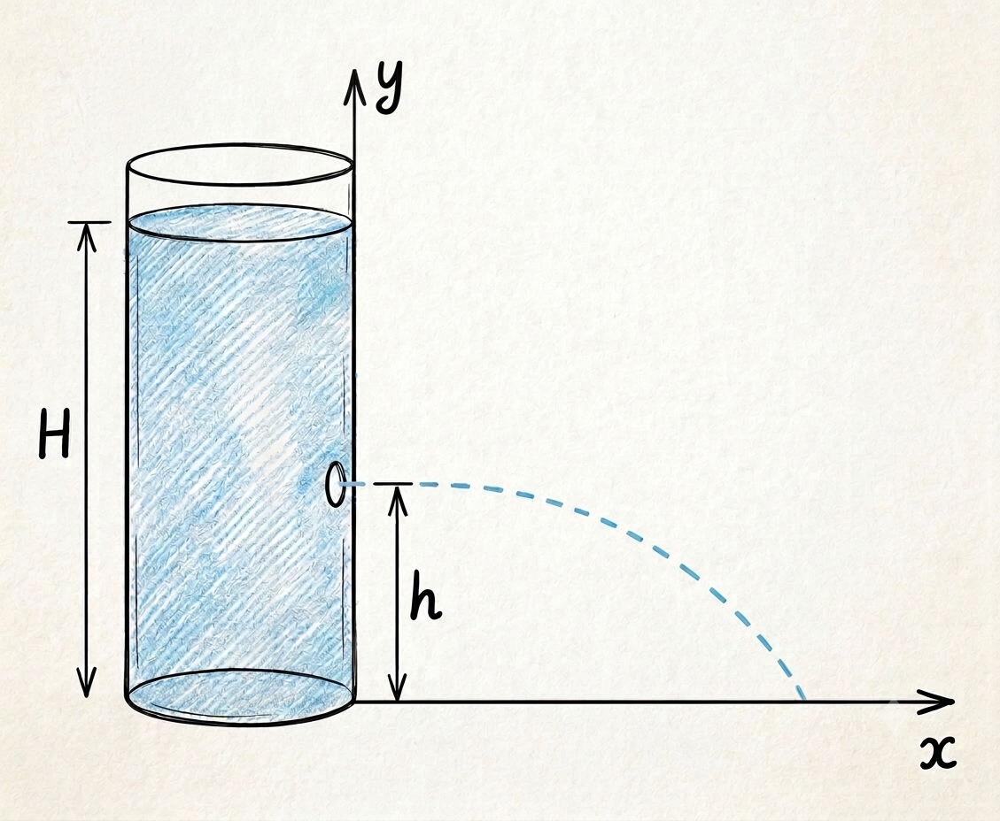

The other day, I saw this [video](https://www.youtube.com/watch?v=4wa8IKMYwK8&t=1080s) from Prof. Julius Sumner Miller and was immediately _enchanted_ by the question:

> How does the water come out of a tall can in which three holes reside?

I knew how the efflux velocity depends on the height of the liquid, but I didn't have a clue about the distance it would travel.

So, here is the solution.

{{}}

Applying Bernoulli's equation between the surface of the fluid and the jet of water exiting the hole, and neglecting all losses of energy:

$$ \rho g H = \rho g h + \frac{1}{2} \rho v ^2 $$

where $\rho$ is the density of the fluid, $g$ is the acceleration due to gravity, and $v$ is the velocity of the water jet. The velocity of the jet therefore depends on the square root of the height of liquid above the hole:

$$ v = \sqrt{2 g (H - h)} $$

Since the jet of water is normal to the wall, the velocity components are $v_x = v$ and $v_y = 0$.

Neglecting air resistance, the time it takes for an infinitesimal volume of water to travel from the hole to the ground can be obtained by solving the equation of motion along the y-axis:

$$ y = y_0 + v_{y,0} t + \frac{1}{2} a_y t^2 $$

In this particular case, we have:

$$ 0 = h - \frac{1}{2} g t^2 $$

from which we get:

$$ t = \sqrt{2h/g} $$

Since there are no forces acting along the x-direction, the distance traveled along that axis is:

$$ x = x_0 + v_{x,0} t $$

Replacing with the respective values, we get:

$$ x = \sqrt{2g(H-h)} \sqrt{2h/g} $$

$$ x = 2 \sqrt{(H-h)h} $$

Since the square root is a monotonic function, the maximum of $x$ with respect to $h$ corresponds to the maximum of $(H-h)h$:

$$ \frac{d}{dh} (H-h)h = -h + (H-h) = 0 $$

$$ h_{max} = H/2 $$

So, the maximum jet distance is obtained when the hole is at half the liquid height. The corresponding distance is:

$$ x_{max} = 2 \sqrt{\left(H-\frac{H}{2}\right)\frac{H}{2}} = H $$

There is something almost magical about this elegant result: the maximum distance traveled by the jet is exactly equal to the height of the liquid.

<canvas id="can-3-holes"></canvas>

