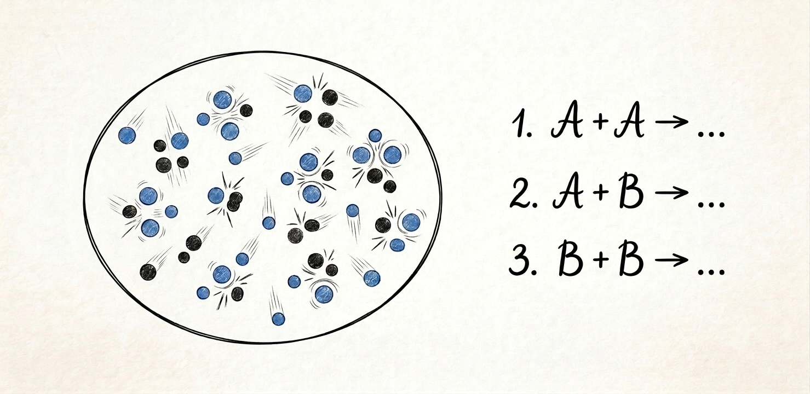

Consider an elementary reaction in which a reactant $\mathrm{A}$ reacts with itself to produce a product  $\mathrm{P}$:

$$ \mathrm{A} + \mathrm{A} \xrightarrow{}  \mathrm{P} $$

with rate coefficient $k$. The rate of consumption of $\mathrm{A}$ is then:

$$ - \frac{\mathrm{d}[\mathrm{A}]}{\mathrm{d}t} = 2  k [\mathrm{A}]^2 $$

Now suppose we add another reactant $\mathrm{B}$, with similar reactivity to $\mathrm{A}$. In this new scenario, $\mathrm{A}$ can also react with B:

$$ \mathrm{A} + \mathrm{B} \xrightarrow{} \mathrm{R} $$

Since this additional reaction step consumes a single $\mathrm{A}$ molecule, and since $\mathrm{A}$ and $\mathrm{B}$ have similar reactivity, one might be tempted to write:

$$ - \frac{\mathrm{d}[\mathrm{A}]}{\mathrm{d}t}
\stackrel{?}{=} 2 k [\mathrm{A}]^2 + k [\mathrm{A}] [\mathrm{B}]
$$

Is this correct? Why? Why not?

{{}}

Over the years, I have stumbled upon this problem more often than I would like to confess. I find it quite counterintuitive, so let's start from the very basics and see where that takes us.

We begin by enumerating the three possible reaction steps and assigning each of them its own rate coefficient:

$$ \mathrm{A} + \mathrm{A} \xrightarrow[]{k_{\mathrm{AA}}}  \mathrm{P} $$

$$ \mathrm{B} + \mathrm{B} \xrightarrow[]{k_{\mathrm{BB}}} \mathrm{Q} $$

$$ \mathrm{A} + \mathrm{B} \xrightarrow[]{k_{\mathrm{AB}}} \mathrm{R} $$

For any reaction, the corresponding *reaction rate* is defined as the rate of change of a reactant or product concentration, normalized by its respective stoichiometric coefficient. For instance, for the first reaction we have:

$$
v_{\mathrm{AA}}
= - \frac{1}{2} \frac{\mathrm{d}[\mathrm{A}]}{\mathrm{d}t}
= +             \frac{\mathrm{d}[\mathrm{P}]}{\mathrm{d}t}
= k_{\mathrm{AA}} [\mathrm{A}]^2
$$

The total rate of consumption of $\mathrm{A}$ is therefore:

$$ - \frac{\mathrm{d}[\mathrm{A}]}{\mathrm{d}t}
= 2  v_{\mathrm{AA}} + v_{\mathrm{AB}}
= 2  k_{\mathrm{AA}} [\mathrm{A}]^2 + k_{\mathrm{AB}} [\mathrm{A}] [\mathrm{B}]
$$

and, similarly, for $\mathrm{B}$:

$$ - \frac{\mathrm{d}[\mathrm{B}]}{\mathrm{d}t}
= 2  v_{\mathrm{BB}} + v_{\mathrm{AB}}
= 2  k_{\mathrm{BB}} [\mathrm{B}]^2 + k_{\mathrm{AB}} [\mathrm{A}] [\mathrm{B}]
$$

The assumption that $\mathrm{A}$ and $\mathrm{B}$ have identical reactivity implies:

$$ k_{\mathrm{AA}}=k_{\mathrm{BB}}=k $$

The question is therefore how $k_{\mathrm{AB}}$ is related to $k$. To answer this, we can imagine that $\mathrm{A}$ and $\mathrm{B}$ are just two particular forms of a hypothetical species $\mathrm{C}$, such that:

$$  [\mathrm{C}] = [\mathrm{A}] +  [\mathrm{B}] $$

For this species, the total reaction is simply:

$$ \mathrm{C} + \mathrm{C} \xrightarrow{} \mathrm{products} $$

so its total consumption rate must follow:

$$ - \frac{\mathrm{d}[\mathrm{C}]}{\mathrm{d}t} = 2  k [\mathrm{C}]^2 $$

We can now expand both sides of the equality:

$$ - \left(
\frac{\mathrm{d}[\mathrm{A}]}{\mathrm{d}t} +
\frac{\mathrm{d}[\mathrm{B}]}{\mathrm{d}t}
\right)
= 2  k \left( [\mathrm{A}] + [\mathrm{B}]  \right)^2
$$

Substituting the individual consumption rate expressions into the left-hand side and expanding the binomial square on the right-hand side yields:

$$
2  k [\mathrm{A}]^2 +
2 k_{\mathrm{AB}} [\mathrm{A}] [\mathrm{B}] +
2  k [\mathrm{B}]^2
= 2 k [\mathrm{A}]^2 + 4 k [\mathrm{A}] [\mathrm{B}] +  2 k [\mathrm{B}]^2
$$

For this equality to hold for arbitrary concentrations $[\mathrm{A}]$ and $[\mathrm{B}]$, we must have:

$$ k_{\mathrm{AB}} = 2 k $$

Therefore, the *correct* expression for the total rate of consumption of $\mathrm{A}$ involves a factor $2k$ in both terms:

$$ - \frac{\mathrm{d}[\mathrm{A}]}{\mathrm{d}t}
{=} 2 k [\mathrm{A}]^2 + 2 k [\mathrm{A}] [\mathrm{B}]
$$

"How can this make any sense?" — you might ask.

The key is that the two factors of $2$ have completely different origins:

* In the self-reaction term, the factor of $2$ represents the *stoichiometric* coefficient: each reaction event consumes two molecules of $\mathrm{A}$.

* In the cross-reaction term, it is instead a *symmetry* (or *combinatorial*) factor arising because $\mathrm{A}$ and $\mathrm{B}$ are distinguishable molecules. 

From a microscopic collision theory perspective, when counting collisions between identical molecules ($\mathrm{A} + \mathrm{A}$), we must divide by 2 to avoid double-counting pair $(A_1, A_2)$ and pair $(A_2, A_1)$. For distinguishable molecules ($\mathrm{A} + \mathrm{B}$), pair $(A_1, B_1)$ is distinct from $(A_2, B_1)$, so no division by 2 occurs. Thus, the effective rate constant for collisions between distinguishable partners is $2k$.
