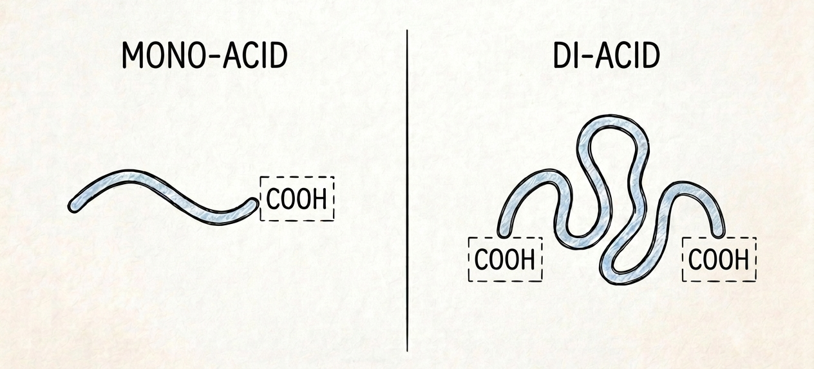

Suppose we have a weak mono-acid $\mathrm{HA}$ and a diacid $\mathrm{H_2D}$ that is, in all chemical respects, similar to $\mathrm{HA}$, except that it has two acid groups so far apart that they do not interact. How do the acid dissociation constants of $\mathrm{H_2D}$ relate to that of $\mathrm{HA}$?

{{}}

Certainly, since the two acid groups are identical, we might expect:

$$
K_{\mathrm{a1}}(\mathrm{H_2D})
\stackrel{?}{=}
K_{\mathrm{a2}}(\mathrm{H_2D})
\stackrel{?}{=}
K_{\mathrm{a}}(\mathrm{HA})
$$

Or not?

Although the question is framed in terms of acid dissociation, the problem is actually quite general. It arises whenever we consider the equilibrium of multifunctional species.

Here is one solution. It is probably not the simplest one, but I like it.

The acid dissociation of the mono-acid $\mathrm{HA}$ can be represented as:

$$
\mathrm{HA}
\rightleftarrows
\mathrm{A^-} + \mathrm{H^+}
$$

with the corresponding (concentration-based) equilibrium constant

$$
K_{\mathrm{a}} = \frac{[\mathrm{A^-}][\mathrm{H^+}]}{[\mathrm{HA}]}
$$

For the diacid $\mathrm{H_2D}$, there are two consecutive dissociation steps:

$$
\mathrm{H_2D}
\rightleftarrows
\mathrm{HD^-} + \mathrm{H^+}
$$

$$
\mathrm{HD^-}
\rightleftarrows
\mathrm{D^{2-}} + \mathrm{H^+}
$$

with equilibrium constants:

$$
K_{\mathrm{a1}} = \frac{[\mathrm{HD^-}][\mathrm{H^+}]}{[\mathrm{H_2D}]}
$$

$$
K_{\mathrm{a2}} = \frac{[\mathrm{D^{2-}}][\mathrm{H^+}]}{[\mathrm{HD^-}]}
$$

Since the two acid groups of $\mathrm{H_2D}$ do not interact, the system can be described in terms of the (average) degree of dissociation of an acid group, $\alpha$. From elementary probability, we have:

$$
\begin{aligned}
\frac{[\mathrm{H_2D}]}{C_{\mathrm{H_2D}}}   &= (1-\alpha)^2 \\
\frac{[\mathrm{HD^-}]}{C_{\mathrm{H_2D}}}   &= 2\alpha(1-\alpha) \\
\frac{[\mathrm{D^{2-}}]}{C_{\mathrm{H_2D}}} &= \alpha^2
\end{aligned}
$$

Substituting these species concentrations into the expressions for the equilibrium constants gives:

$$
K_{\mathrm{a1}} = 2\frac{\alpha[\mathrm{H^+}]}{1-\alpha}
$$

$$
K_{\mathrm{a2}} = \frac{1}{2}\frac{\alpha[\mathrm{H^+}]}{1-\alpha}
$$

But, of course, we can apply the same reasoning to $\mathrm{HA}$ and write:

$$
K_{\mathrm{a}} = \frac{\alpha[\mathrm{H^+}]}{1-\alpha},
$$

from which it follows that:

$$
\begin{aligned}
K_{\mathrm{a1}} &= 2K_{\mathrm{a}} \\
K_{\mathrm{a2}} &= \frac{1}{2}K_{\mathrm{a}}
\end{aligned}
$$

The result is simple — some might even say trivial. Yet it is also somewhat surprising. Isn't it counterintuitive that a diacid with two identical acid groups has two different $K_{\mathrm{a}}$ values?

Now, you might say: *"This can't be true! If it has two $K_{\mathrm{a}}$ values, the titration curve will have two steps, which contradicts the fact that the two acid groups are identical!"*

Well, let's write the charge balance for a hypothetical titration with NaOH and settle the matter once and for all. The charge balance is:

$$
[\mathrm{H^+}] + [\mathrm{Na^+}] = [\mathrm{OH^-}] + [\mathrm{HD^-}] + 2[\mathrm{D^{2-}}]
$$

The concentrations of the ionized species are:

$$
[\mathrm{HD^-}] = C_{\mathrm{H_2D}}
\frac{K_{\mathrm{a1}}[\mathrm{H^+}]}
{[\mathrm{H^+}]^2 + K_{\mathrm{a1}}[\mathrm{H^+}] + K_{\mathrm{a1}}K_{\mathrm{a2}}}
$$

$$
[\mathrm{D^{2-}}] = C_{\mathrm{H_2D}}
\frac{K_{\mathrm{a1}}K_{\mathrm{a2}}}
{[\mathrm{H^+}]^2 + K_{\mathrm{a1}}[\mathrm{H^+}] + K_{\mathrm{a1}}K_{\mathrm{a2}}}
$$

Substituting these expressions into the charge balance gives:

$$
[\mathrm{H^+}] + [\mathrm{Na^+}] = [\mathrm{OH^-}] +
C_{\mathrm{H_2D}}
\frac{K_{\mathrm{a1}}[\mathrm{H^+}] + 2K_{\mathrm{a1}}K_{\mathrm{a2}}}
{[\mathrm{H^+}]^2 + K_{\mathrm{a1}}[\mathrm{H^+}] + K_{\mathrm{a1}}K_{\mathrm{a2}}}
$$

Now substitute $K_{\mathrm{a1}}=2K_{\mathrm{a}}$ and $K_{\mathrm{a2}}=K_{\mathrm{a}}/2$ to obtain:

$$
[\mathrm{H^+}] + [\mathrm{Na^+}] = [\mathrm{OH^-}] +
2 C_{\mathrm{H_2D}}
\frac{K_{\mathrm{a}}}{[\mathrm{H^+}] + K_{\mathrm{a}}}
$$

This is exactly the same expression one obtains for two equivalents of the corresponding monoprotic acid.

So, surprising as it may seem, the result is correct after all!


